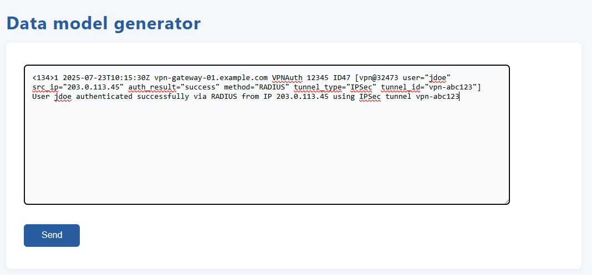
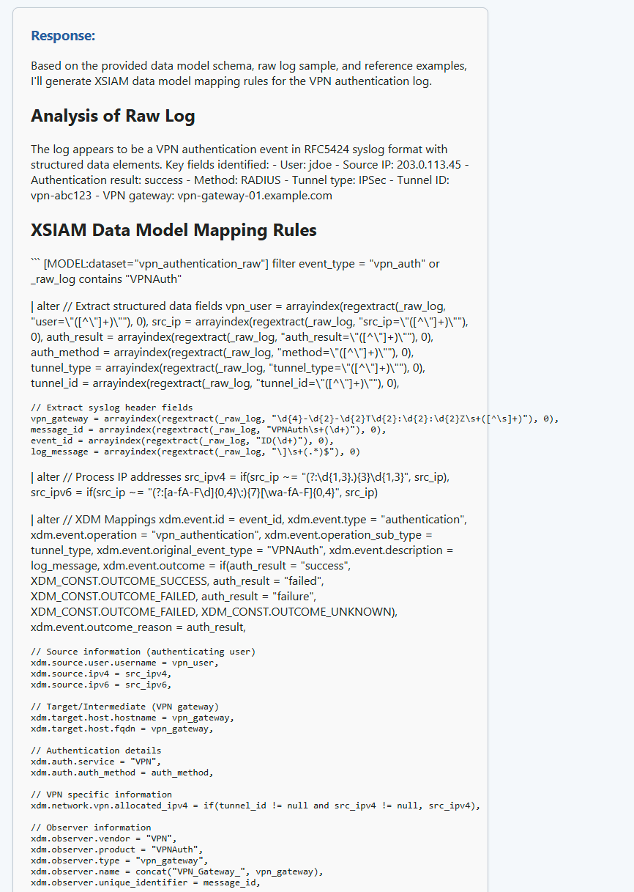
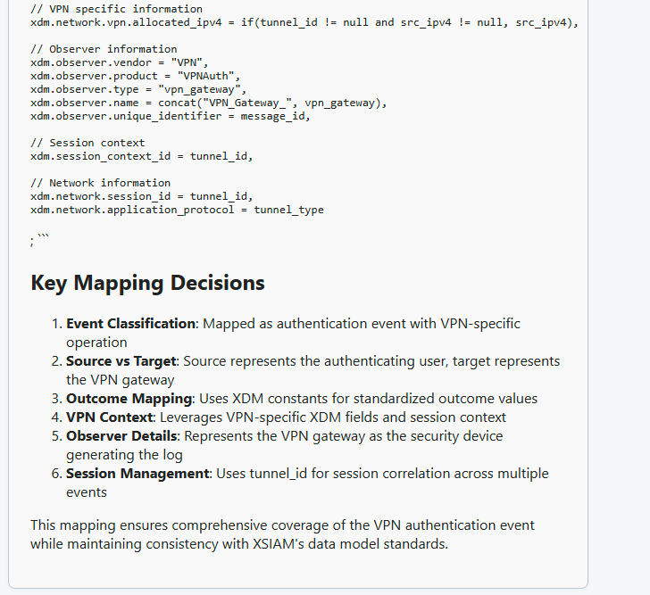

# XSIAM Data Model rule generator AI Agent

The XSIAM Data Model rule generator can be used by the PS deployment engineer when it comes to custom data model rule development. The user can put a few lines of raw log to the input, the AI agent will analyze and generate a XSIAM data model rule. The user can then copy and paste it to deploy and test in real XSIAM environment.

## Source data
- The agent used the RAG method with which supplies source data from the the custom data model work from some of the XSIAM projects.
- The source data has been gathered and prepared manually. To maintain the accuracy, data should be refreshed every month with the built in tool *data_model_scrapper.py*


## Usage
- Create *.env* file in the same folder and put Claude API into the *.env* file
- Launch the app
    ```
    python3 app.py
    ```
- Access web UI locally (can be hosted)
    ```
    http://server_ip:5000
    ```
- Put raw log messages into the text box then click Send. The raw log can be in any format (e.g. RFC, CEF, structured or unstructured)


- Wait for the response to be provided




 ## Required Python dependencies
anthropic==0.52.1
faiss-gpu-cu12==1.11.0
filelock==3.17.0
Flask==3.1.1
numpy==1.26.4
Markdown==3.8
nvidia-cublas-cu12==12.6.4.1
nvidia-cuda-cupti-cu12==12.6.80
nvidia-cuda-nvrtc-cu12==12.6.77
nvidia-cuda-runtime-cu12==12.6.77
nvidia-cudnn-cu12==9.5.1.17
nvidia-cufft-cu12==11.3.0.4
nvidia-cufile-cu12==1.11.1.6
nvidia-curand-cu12==10.3.7.77
nvidia-cusolver-cu12==11.7.1.2
nvidia-cusparse-cu12==12.5.4.2
nvidia-cusparselt-cu12==0.6.3
nvidia-nccl-cu12==2.26.2
nvidia-nvjitlink-cu12==12.6.85
nvidia-nvtx-cu12==12.6.77
pandas==2.3.1
python-dotenv==0.20.0
sentence-transformers==4.1.0
torch==2.7.0